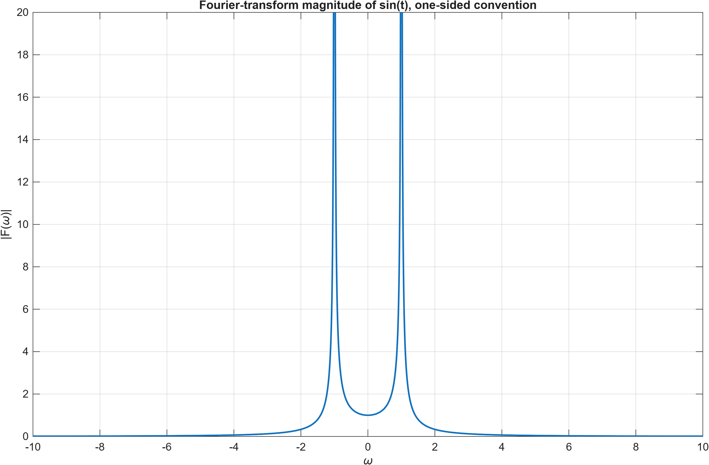
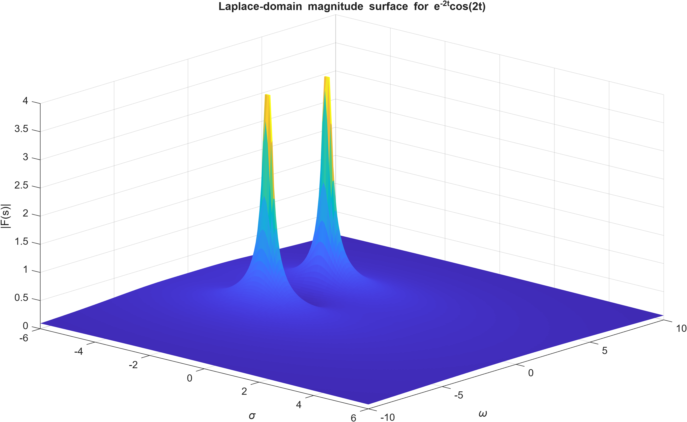
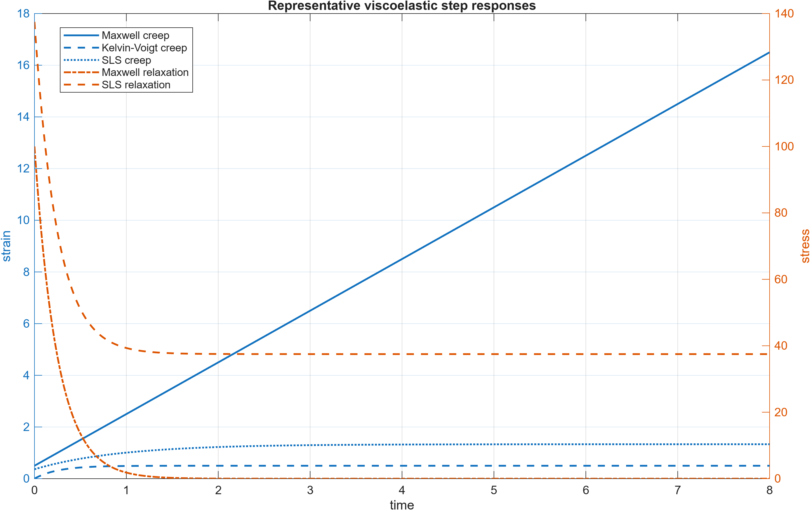
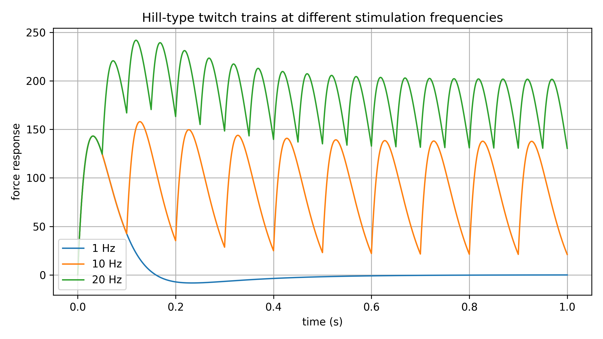

# Viscoelastic and Hill-Type Muscle Modeling

MATLAB/Simulink implementation of classical viscoelastic body models and Hill-type muscle dynamics. The repository combines analytical derivations, time-domain simulations, Laplace-domain analysis, and muscle twitch-response simulations in a standalone project structure.

## Scope

The repository covers three modeling layers:

1. **Fourier and Laplace-domain system analysis**
   - Fourier-transform magnitude examples.
   - Laplace-domain magnitude surfaces.
   - Relationship between the `s = sigma + j*omega` domain and Fourier-domain slices.

2. **Viscoelastic body modeling**
   - Maxwell model.
   - Kelvin-Voigt model.
   - Standard linear solid / Kelvin-body-style model.
   - Creep and stress-relaxation responses under idealized step loading and displacement.

3. **Hill-type muscle response modeling**
   - Twitch response represented by a two-exponential activation/deactivation structure.
   - Mechanical filtering through serial/parallel elastic and damping terms.
   - Repeated twitch trains at 1, 10, and 20 Hz.

## Repository structure

```text
.
├── README.md
├── LICENSE
├── CITATION.cff
├── docs/
│   ├── equation_summary.md
│   ├── technical_report.md
│   └── assets/equations/
│   └── assets/model_diagrams/
├── figures/
├── simulink/
│   ├── README.md
│   └── ViscoelasticBodies.slx
├── src/
│   ├── run_all_demos.m
│   ├── fourier_laplace/
│   ├── viscoelastic/
│   └── muscle/
└── tests/
    └── run_smoke_tests.m
```

## Example outputs

### Fourier-transform magnitude



### Laplace-domain magnitude surface



### Viscoelastic step responses



### Hill-type twitch trains



### Simulink model artifact


## How to run

Open MATLAB from the repository root and run:

```matlab
addpath(genpath('src'));
run_all_demos
```

To run basic numerical checks:

```matlab
addpath(genpath('src'));
run('tests/run_smoke_tests.m')
```

The Simulink model can be opened manually:

```matlab
open_system('simulink/ViscoelasticBodies.slx')
```

## Equation rendering note

The equation summary uses SVG equation images instead of raw LaTeX blocks. This avoids broken rendering in GitHub, VS Code previews, and other Markdown viewers that do not process LaTeX consistently.

## Requirements

- MATLAB R2020b or newer is recommended.
- Simulink is required only for the `.slx` model.
- The MATLAB scripts use basic plotting and numerical operations; no specialized toolbox is required for the scripted demos.

## Notes on interpretation

This is an educational computational biomechanics project, not a validated clinical or experimental muscle model. Parameters are included to reproduce the modeling workflow and demonstrate analytical-to-computational implementation.

## Repository visibility and license

This repository is prepared for **public GitHub visibility** as a project. It is public for inspection and citation, but it is **not an open-source release**. Reuse, redistribution, modification, or republication requires explicit permission from the author. See `LICENSE`.
