# Equation Summary

This document uses SVG equation images so the formulas render consistently in GitHub and standard Markdown previews. 

## Fourier and Laplace-domain examples

The Fourier transform is treated as the frequency-domain slice of the more general Laplace-domain representation.

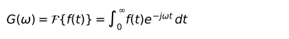


For the damped cosine response:

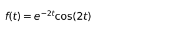

The Laplace-domain representation is:


The Fourier-domain representation is the slice at `s = j*w`:


## Maxwell model

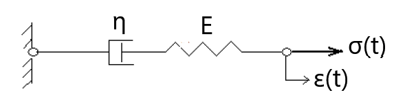

A Maxwell body consists of a spring and dashpot in series. Under constant stress, the creep strain is:

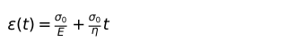

```text
σ_0   : Applied force
ε     : Displacement output
E     : Spring stiffness coeff.
η     : Dashpot viscosity coeff. 
t     : Time
```

Under ideal step strain, the stress relaxation is:


```text
σ     : Force output
ε_0   : Applied Displacement
E     : Spring stiffness coeff.
η     : Dashpot viscosity coeff. 
t     : Time
```

## Kelvin-Voigt model

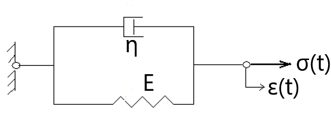

A Kelvin-Voigt body consists of a spring and dashpot in parallel. Under constant stress, the creep strain is:


```text
σ_0   : Applied force
ε     : Displacement output
E     : Spring stiffness coeff.
η     : Dashpot viscosity coeff. 
t     : Time
```

## Standard linear solid / Kelvin-body-style relaxation

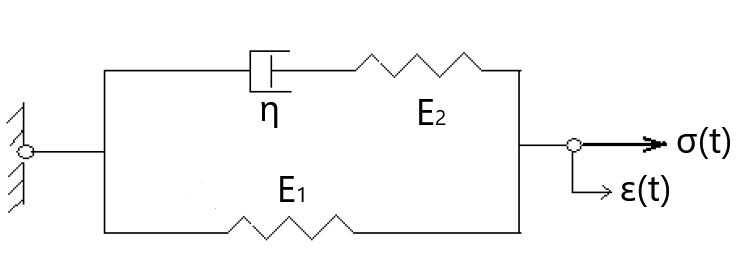

A compact standard linear solid representation under constant stress, the creep strain is:

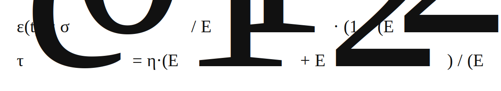

```text
σ_0   : Applied force
ε     : Displacement output
E_1   : Parallel spring stiffness coeff.
E_2   : Maxwell / serial spring stiffness coeff.
η     : Dashpot viscosity coeff. 
t     : Time
tau_c : Time constant
```

A compact standard linear solid representation is used for Kelvin-body-style stress relaxation:

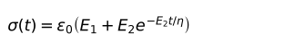

```text
σ     : Force output
ε_0   : Applied Displacement
E_1   : Parallel spring stiffness coeff.
E_2   : Maxwell / serial spring stiffness coeff.
η     : Dashpot viscosity coeff. 
t     : Time
```

This captures an immediate elastic response followed by partial relaxation to a nonzero equilibrium stress.

## Hill-type twitch response

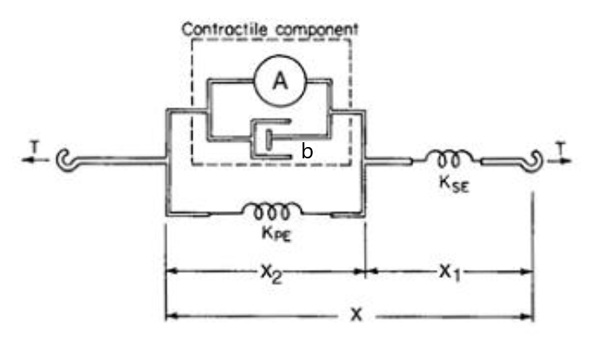

The twitch impulse response is represented as the difference of two exponentials filtered by serial/parallel elastic and damping terms:

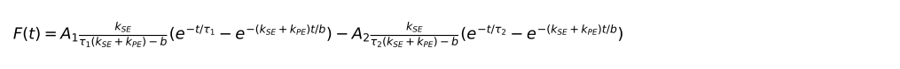

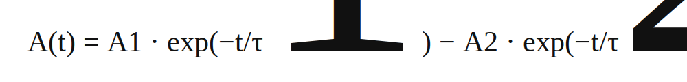

```text
for this workout:
A1    = 48144
A2    = 45845
τ_1   = 0.0326
τ_2   = 0.034 
A_1   = A1 * τ_1 = 1570
A_2   = A2 * τ_2 = 1559
```

```text
F(t)       : Muscle-force output
A(t)       : Active-force input
A1, A2     : Amplitude coefficients of the active-force input
τ_1, τ_2   : Exponential decay time constants
A_1, A_2   : Time-scaled amplitude coefficients
k_SE       : Serial spring stiffness coeff.
k_PE       : Parallel spring stiffness coeff.
b          : Dashpot viscosity coeff.
t          : Time
```

For repeated stimulation, twitch responses are superposed at each stimulation time:


Only terms satisfying `t - n*T >= 0` contribute to the sum.

```text
F_train(t) : Total muscle force generated by repeated twitch responses
F(t)       : Single-twitch force response
n          : Stimulation index
T          : Time interval between consecutive stimulation pulses
f_stim     : Stimulation frequency
t          : Time  
```


